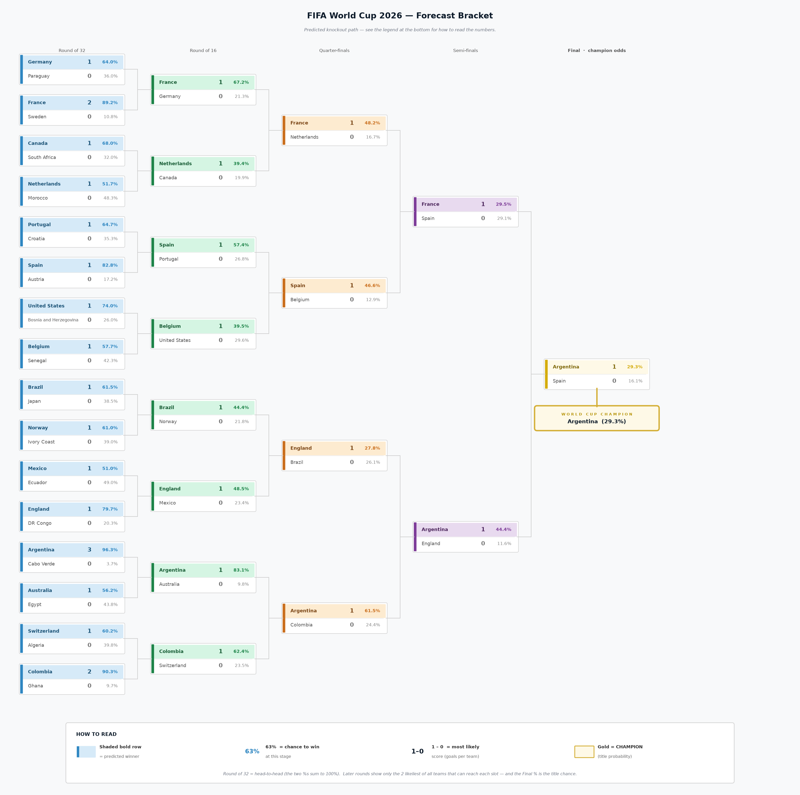

# FIFA World Cup 2026 Knockout Prediction

Monte Carlo simulation of the FIFA World Cup 2026 — a live, key-free **title-odds forecast** for all 48 nations built on an Elo + Dixon-Coles bivariate-Poisson model, plus a legacy ML-classifier knockout bracket.



*Representative knockout bracket with per-round advancement probabilities and the projected champion (seed 42, 100,000 simulations, `elo_prior_weight = 0.8`). The full ranked title-odds leaderboard (`docs/title_odds.png`) and a per-round heatmap are also produced. See [Live Title-Odds Forecast](#live-title-odds-forecast) to regenerate.*

## Overview

This project predicts the FIFA World Cup 2026 knockout stage through a multi-stage pipeline:

1. **Data acquisition** — downloads historical international and club match statistics from the [football-data.org](https://www.football-data.org/) REST API v4 via a rate-limited client with circuit-breaker retry logic
2. **Training** — fits three ML classifiers (SVM, Random Forest, Gaussian Naive Bayes) on historical match data (2006 onward) to predict the home/favoured team winning a single match
3. **Distribution fitting** — fits scipy statistical distributions to each national team's recent per-match performance (goals, shots, shots on target, possession, pass accuracy)
4. **Monte Carlo simulation** — samples synthetic match features from the fitted distributions, predicts each tie's outcome with the trained classifier, and runs thousands of full knockout brackets (Round of 32 → Round of 16 → Quarter-finals → Semi-finals → Final) to produce per-team advancement probabilities at every round
5. **Visualization** — renders a bracket PNG and round-probability charts

Unlike the NBA original this project is derived from, World Cup knockout ties are decided by a **single match** — extra time and penalties collapse into one win/loss outcome — so there is no best-of-N series to configure anywhere in the pipeline.

## Live Title-Odds Forecast

The **canonical** output is a live, in-tournament forecast of the World Cup 2026 winner — title odds for all 48 nations plus round-by-round advancement probabilities. It runs **without an API key**: team strengths come from the [martj42 international results](https://github.com/martj42/international_results) dataset (CC0, all nations 1872→present), and the WC2026 group state is reconstructed from the same cache when the live football-data.org API is unreachable.

The engine is an Elo + Dixon-Coles bivariate-Poisson model (the same family the Opta supercomputer uses), conditioned on the group results played to date and run through 100,000 Monte Carlo tournaments (the config default: at 100k the sampling 95% CI on title odds is ≈ ±0.3%, below which the model/calibration uncertainty dominates). The fitted attack/defence abilities — which on raw goals over-reward sides that ran up big group-stage scorelines — are blended toward an Elo strength prior (`poisson.elo_prior_weight`, default `0.8`) so reputable teams are not understated. The weight was tuned by match-level RPS over WC2014/18/22 (pure goals = 0.2195 RPS → `0.8` = 0.2082, ~5 % better).

```bash
# Live title-odds forecast (no API key required; renders PNG charts)
worldcup-playoff forecast --seed 42 --output docs   # 100k tournaments (config default)

# Tune the Elo-prior blend weight by RPS / log-loss / Brier over past World Cups
worldcup-playoff backtest --tune-prior
```

The `forecast` command writes three charts to the `--output` directory: `bracket.png` (the NBA-style knockout tree with per-round advancement % and a champion banner, shown above), `title_odds.png` (the ranked title-odds leaderboard), and `advancement.png` (a per-round probability heatmap).

## Installation

Requires Python 3.11+.

```bash
git clone https://github.com/SilvioBaratto/worldcup-2026-prediction.git
cd worldcup-2026-prediction
pip install -e .
```

For development (adds pytest, pytest-cov, ruff, mypy):

```bash
pip install -e ".[dev]"
```

Without editable install:

```bash
pip install -r requirements.txt
```

### API key

The football-data.org client reads its key from the `FOOTBALL_DATA_API_KEY` environment variable and sends it as the `X-Auth-Token` header. The client works **unauthenticated** as well, but is then subject to the free-tier rate limit of 10 requests/minute (the default 6 s spacing between calls is tuned for exactly this).

```bash
export FOOTBALL_DATA_API_KEY="your-token-here"
```

## Quick Start

```bash
# Run the full pipeline: clean → train → fit → simulate → visualize
worldcup-playoff run --bracket config/playoff_2026.toml

# Or without installation
python -m worldcup_playoff run --bracket config/playoff_2026.toml
```

## CLI Reference

All commands accept `--verbose` / `-v` (countable: `-v` for INFO, `-vv` for DEBUG). Most accept `--config` / `-c` (default: `config/default.toml`).

### Data Acquisition

#### `download`

Bulk-download all World Cup datasets from football-data.org in one pass (`teams.csv`, `matches.csv`, `ranking.csv`, `players.csv`, `match_details.csv`).

```bash
worldcup-playoff download --seasons 2006-2026 --output-dir dataset/csv
worldcup-playoff download --only matches,teams --seasons 2018-2026
worldcup-playoff download --skip-details  # skip match_details.csv
```

| Flag | Default | Description |
|------|---------|-------------|
| `--seasons` | `2006-2026` | Season range as `START-END` (4-digit years) |
| `--output-dir` | `dataset/csv` | Output directory for all CSVs |
| `--skip-details` | `False` | Skip `match_details.csv` |
| `--only` | all | Comma-separated subset: `teams`, `matches`, `ranking`, `players`, `match-details` |

#### `build-teams`

Fetch national-team metadata across major competitions (`WC`, `EC`, `CA`) and write `teams.csv`.

```bash
worldcup-playoff build-teams --output-dir dataset/csv
```

| Flag | Default | Description |
|------|---------|-------------|
| `--output-dir` | `dataset/csv` | Output directory for `teams.csv` |

#### `build-matches`

Fetch finished match results per competition per season and assemble `matches.csv`.

```bash
worldcup-playoff build-matches --start-year 2006 --end-year 2026
```

| Flag | Default | Description |
|------|---------|-------------|
| `--start-year` | `2006` | First season year to query |
| `--end-year` | current year | Last season year to query |
| `--output-dir` | `dataset/csv` | Output directory for `matches.csv` |

#### `build-match-details`

Fetch per-match detail statistics for every match ID in `matches.csv` and assemble `match_details.csv`. Supports checkpointing (a `.partial` file) so an interrupted run resumes without re-fetching.

```bash
worldcup-playoff build-match-details --matches-csv dataset/csv/matches.csv
```

| Flag | Default | Description |
|------|---------|-------------|
| `--matches-csv` | `dataset/csv/matches.csv` | Source CSV to pull match IDs from |
| `--checkpoint-every` | `100` | Save partial progress every N matches |
| `--output-dir` | `dataset/csv` | Output directory for `match_details.csv` |

> **Note on heuristics:** the free tier does not expose shots, possession, or pass accuracy per match. When those fields are absent the builder fills them with **fixed, deterministic** formulae (never random): `SHOTS = goals * 5 + 7`, `SHOTS_ON_TARGET = max(goals + 2, shots // 3)`, `POSSESSION = 50.0`, `PASS_PCT = 75.0`. A paid tier exposing `TOTAL_SHOTS` / `SHOTS_ON_TARGET` / `BALL_POSSESSION` / `PASS_ACCURACY` statistics overrides the heuristics automatically.

#### `generate-bracket`

Auto-generate a knockout bracket TOML from the competition's qualified teams (Round of 32, seed `1 vs 32`, `2 vs 31`, …).

```bash
worldcup-playoff generate-bracket --season 2026
worldcup-playoff generate-bracket --output config/playoff_2026.toml
```

| Flag | Default | Description |
|------|---------|-------------|
| `--season` / `-s` | auto-detected | World Cup year (e.g. `2026`) |
| `--competition` | `WC` | football-data.org competition code |
| `--output` / `-o` | `config/playoff_{year}.toml` | Output TOML path |

### Pipeline Stages

#### `clean`

Stage 1: Read raw CSVs, merge `matches.csv` with `match_details.csv` on `MATCH_ID`, filter by `min_date`, drop drawn matches, fix zero possession/pass-pct values with epsilon, add the binary `HOME_WIN` target, and write `dataset/train_data.csv`.

```bash
worldcup-playoff clean
```

#### `train`

Stage 2: Train one or more classifiers (temporal split), print evaluation metrics, save models.

```bash
worldcup-playoff train --classifier all          # svm, random-forest, naive-bayes, or all
```

| Flag | Default | Description |
|------|---------|-------------|
| `--classifier` | `all` | `svm`, `random-forest`, `naive-bayes`, or `all` |

#### `fit`

Stage 3: Fit scipy statistical distributions to each national team's per-feature performance data.

```bash
worldcup-playoff fit
```

#### `simulate`

Stage 4: Run the Monte Carlo knockout simulation (requires pre-trained models and distributions).

```bash
worldcup-playoff simulate --bracket config/playoff_2026.toml --n-simulations 10000
```

| Flag | Default | Description |
|------|---------|-------------|
| `--bracket` / `-b` | `config/playoff_2026.toml` | Bracket TOML file |
| `--n-simulations` / `-n` | from config (100000) | Override simulation count |

#### `bracket`

Simulate and render a bracket PNG visualization.

```bash
worldcup-playoff bracket --bracket config/playoff_2026.toml --output output/plots/bracket.png
```

| Flag | Default | Description |
|------|---------|-------------|
| `--bracket` / `-b` | `config/playoff_2026.toml` | Bracket TOML file |
| `--n-simulations` / `-n` | from config | Override simulation count |
| `--output` / `-o` | `output/plots/bracket.png` | Output PNG path |

#### `run`

Execute the full pipeline end-to-end: clean, train all classifiers, fit distributions, simulate, and save visualizations.

```bash
worldcup-playoff run --bracket config/playoff_2026.toml
```

| Flag | Default | Description |
|------|---------|-------------|
| `--bracket` / `-b` | `config/playoff_2026.toml` | Bracket TOML file |

### Live Forecast (Elo + Dixon-Coles)

#### `forecast`

Run the live WC2026 title-odds forecast (no API key required; uses the martj42 schedule). Renders `bracket.png`, `title_odds.png`, and `advancement.png`.

```bash
worldcup-playoff forecast --seed 42 --output docs   # 100k tournaments (config default)
```

| Flag | Default | Description |
|------|---------|-------------|
| `--config` / `-c` | `config/default.toml` | Pipeline config (sets `poisson.elo_prior_weight`) |
| `--seed` | `42` | Random seed (re-runnable; same seed → identical odds) |
| `--n-simulations` / `-n` | config value | Monte Carlo iterations |
| `--output` / `-o` | `cfg.visualization.output_dir` | Directory for PNG charts |
| `--no-plots` | off | Skip writing PNG charts |

#### `backtest`

Run the time-aware WC backtest (RPS / log-loss / Brier) of the RF hybrid vs the bookmaker + legacy baselines. With `--tune-prior`, instead sweep `poisson.elo_prior_weight` over WC2014/18/22 through the Elo + Dixon-Coles path and report the best weight.

```bash
worldcup-playoff backtest                 # RF-hybrid backtest vs baselines
worldcup-playoff backtest --tune-prior     # tune the Elo-prior blend weight
```

| Flag | Default | Description |
|------|---------|-------------|
| `--tune-prior` | off | Sweep `elo_prior_weight` over past WCs and report RPS/log-loss/Brier |

## Pipeline Architecture

```
football-data.org v4                Raw CSVs                    Training Data
       │                               │                              │
       ▼                               ▼                              ▼
 FootballClient ──► Builders ──► dataset/csv/*.csv ──► DataCleaner ──► train_data.csv
 (circuit-breaker,              │                                       │
  rate-limited,                 │                    ┌──────────────────┼──────────────────┐
  X-Auth-Token)                 │                    ▼                  ▼                   ▼
                                │              ClassifierFactory  DistributionFitter
                                │                    │                  │
                                │                    ▼                  ▼
                                │              *.joblib           distributions.json
                                │                    │                  │
                                │                    ▼                  ▼
                                │              GamePredictor ◄──── FeatureSampler
                                │                    │
                                │                    ▼
                                │           TournamentSimulator
                                │              (Monte Carlo,
                                │               single-match ties)
                                │                    │
                                │                    ▼
                                │              RoundResult
                                │                    │
                                │                    ▼
                                │              ResultPlotter
                                │                    │
                                │                    ▼
                                │           bracket.png + probabilities.png
```

The `Pipeline` orchestrator wires all stages together. Each stage is independently runnable via the CLI, and intermediate artifacts (CSVs, `.joblib` models, `distributions.json`) are persisted to disk so stages can be re-run in isolation.

## Project Structure

```
worldcup_playoff/
├── __init__.py             # Package version
├── __main__.py             # Enables `python -m worldcup_playoff`
├── cli.py                  # Typer CLI — all user-facing commands (entry point: worldcup_playoff.cli:app)
├── pipeline.py             # Orchestrator — wires all stages together
├── config.py               # Pydantic config models loaded from TOML
├── types.py                # Classifier Protocol (sklearn interface contract)
├── data/
│   ├── client.py           # FootballClient — rate-limited football-data.org v4 client with
│   │                       #   circuit-breaker retry + session recycling
│   ├── builders.py         # CSV builders: TeamsBuilder, MatchesBuilder, RankingBuilder,
│   │                       #   PlayersBuilder, MatchDetailsBuilder (with checkpointing + heuristics)
│   ├── bracket_builder.py  # BracketBuilder — generates Round-of-32 bracket TOML from qualified teams
│   ├── loader.py           # DataLoader — reads CSVs with schema/dtype validation
│   └── cleaner.py          # DataCleaner — merge, date filtering, draw removal, zero-PCT fix, HOME_WIN
├── models/
│   ├── classifiers.py      # ClassifierFactory (SVM/RF/NB), ClassifierTrainer (fit/save/load)
│   └── evaluation.py       # ModelEvaluator — classification report + confusion matrix + ROC curves
├── simulation/
│   ├── distributions.py    # DistributionFitter, FeatureSampler, FittedDistribution
│   ├── game.py             # GamePredictor — samples features, predicts a single-match tie winner
│   └── tournament.py       # TournamentSimulator — Monte Carlo bracket, BracketSlot tree, RoundResult
└── visualization/
    └── plots.py            # ResultPlotter — bracket PNG + advancement-probability area chart

config/
├── default.toml            # Pipeline parameters (data paths, hyperparams, simulation settings)
└── playoff_2026.toml       # Bracket definition (16 first-round / Round-of-32 matchups)

dataset/
├── csv/                    # Raw CSVs from football-data.org
│   │                       #   (matches, teams, ranking, players, match_details)
└── train_data.csv          # Cleaned training data produced by the clean stage

output/
├── models/                 # Trained classifiers (svm.joblib, random_forest.joblib, naive_bayes.joblib)
├── distributions.json      # Fitted per-team statistical distributions
└── plots/                  # Generated visualizations (bracket.png, probabilities.png)
```

## Configuration

All pipeline parameters live in TOML files.

### `config/default.toml`

| Section | Key Settings |
|---------|-------------|
| `[data]` | CSV paths, date filters (`min_date` = `2006-01-01`, `train_cutoff_date` = `2026-06-01`), `epsilon` for zero-percentage imputation, season ranges, competition codes |
| `[features]` | 10 selected match statistics (5 home + 5 away): `GOALS`, `SHOTS`, `SHOTS_ON_TARGET`, `POSSESSION`, `PASS_PCT`; `per_team_count = 5` |
| `[training]` | Test split (30%), random state (42), per-classifier hyperparameters |
| `[distributions]` | Minimum season (2018), 13 candidate distribution families |
| `[simulation]` | Number of simulations (100000), default classifier (`naive_bayes`) — no series length (single-match ties) |
| `[visualization]` | DPI (80), matplotlib style (`seaborn-v0_8`), output directory |
| `[client]` | Rate-limit delay (6 s, tuned for the free 10 req/min tier), max retries (5), backoff base (2.0), timeout (120 s), custom headers toggle |

### `config/playoff_*.toml`

Bracket definitions with 16 first-round (Round-of-32) matchups. Each matchup specifies `home`, `away`, and an optional `group` label. **Adjacent matchups feed the next round** — the list order defines the bracket tree (matchup 1 winner meets matchup 2 winner, etc.) — and the matchup count must be a power of two.

```toml
name = "2026 FIFA World Cup — Knockout (Round of 32)"

[[matchups]]
home = "Argentina"
away = "Saudi Arabia"
group = "Top"
```

## Features

Ten feature columns are fed to the classifier — five per team, expressed as football box-score metrics:

| Base statistic | Home column | Away column |
|----------------|-------------|-------------|
| Goals | `GOALS_home` | `GOALS_away` |
| Total shots | `SHOTS_home` | `SHOTS_away` |
| Shots on target | `SHOTS_ON_TARGET_home` | `SHOTS_ON_TARGET_away` |
| Ball possession % | `POSSESSION_home` | `POSSESSION_away` |
| Pass accuracy % | `PASS_PCT_home` | `PASS_PCT_away` |

Each fitted per-team distribution is over one of the five **base** statistics; the `FeatureSampler` draws one value per base stat for the home team and one per base stat for the away team, concatenating them (home first, away second) into a length-10 vector for `classifier.predict`.

## ML Classifiers

| Classifier | Key Hyperparameters | Notes |
|-----------|-------------------|-------|
| **SVM** | `C=0.1`, `gamma=0.1`, `kernel="linear"` | Wrapped in `make_pipeline(StandardScaler(), SVC(..., probability=True))` to prevent data leakage |
| **Random Forest** | `n_estimators=500`, `max_depth=50`, `max_features="sqrt"`, `bootstrap=True` | Used directly without scaling |
| **Gaussian Naive Bayes** | `var_smoothing=1.87e-07` | Default classifier for simulation; used directly without scaling |

Training uses a **temporal split** (`shuffle=False`, `test_size=0.3`) to preserve chronological ordering — later matches form the test set, preventing future-data leakage. The binary target is `1` when the home/favoured team wins.

## football-data.org API Client

The `FootballClient` wraps all football-data.org v4 REST calls with production-grade reliability:

- **Rate limiting** — configurable delay (default 6 s) between calls, tuned for the free-tier 10 req/min limit
- **Authentication** — reads `FOOTBALL_DATA_API_KEY` and sends it as `X-Auth-Token`; falls back to unauthenticated access (lower rate) when the variable is absent
- **Circuit breaker** — after 3 consecutive failures, pauses 60 seconds and resets the HTTP session before retrying
- **Exponential backoff with jitter** — retries on HTTP 429/500/502/503/504 and connection errors, with `wait = backoff_base^attempt + random(0,1)`
- **Session recycling** — periodically resets the underlying `requests.Session` (every 50 calls) to prevent stale TCP connections
- **Custom headers** — sends a browser-style `User-Agent` and `Accept` headers to avoid WAF blocks

### football-data.org v4 endpoints used

Base URL: `https://api.football-data.org/v4`

| Endpoint | Builder | Purpose |
|----------|---------|---------|
| `/competitions/{code}/teams` | TeamsBuilder, PlayersBuilder, BracketBuilder | National-team metadata and qualified-team lists |
| `/competitions/{code}/matches` | MatchesBuilder | Finished match results per competition-season (`?season=&status=FINISHED`) |
| `/competitions/{code}/standings` | RankingBuilder | Group/league standings per season (`?season=`) |
| `/teams/{id}` | PlayersBuilder | Squad rosters per team |
| `/matches/{id}` | MatchDetailsBuilder | Per-match detail (score; shots/possession/pass on paid tier) |

Competition codes queried include the FIFA World Cup (`WC`), UEFA European Championship (`EC`), Copa América (`CA`), and major club leagues for additional historical match volume (`CL`, `PL`, `BL1`, `SA`, `PD`, `FL1`).

## Key Design Decisions

- **Single-match knockout ties** — the World Cup knockout format has no best-of-N series. `GamePredictor.predict_tie(home, away)` samples one feature vector, runs the classifier once, and returns the winner. `TournamentSimulator._play_tie` resolves each tie with a single prediction; `SimulationConfig` carries no series-length fields.
- **Dependency injection** — all components receive their dependencies via constructor; no global state. `GamePredictor` receives classifier + sampler + distributions; the `Pipeline` receives config objects.
- **`Classifier` Protocol** — a two-method interface (`fit`, `predict`) in `types.py` that any sklearn-compatible model satisfies, so the simulation layer never depends on a concrete sklearn class.
- **Per-team probabilities** — `RoundResult.probabilities` returns each team's advancement probability as `count / n_simulations`. In rounds with multiple concurrent ties, probabilities sum to the number of ties in the round (not 1.0).
- **Bracket-tree parity** — `build_bracket_tree()` pairs matchups by adjacent index, exactly mirroring `TournamentSimulator._simulate_once`, so the bracket visualization always matches the simulation topology. The matchup-list length must be a power of two.
- **Deterministic stat heuristics** — when the free API tier omits shots/possession/pass-accuracy, `MatchDetailsBuilder` fills them with fixed formulae (never random), so dataset construction is reproducible.
- **Checkpointing** — `MatchDetailsBuilder` writes a `.partial` file every 100 matches, enabling resumption after network failures during long downloads.

## Results

**Live forecast (canonical).** `worldcup-playoff forecast` produces the knockout bracket shown at the top of this README (`docs/bracket.png`), the ranked title-odds leaderboard (`docs/title_odds.png`), and a per-round advancement heatmap (`advancement.png`). With `elo_prior_weight = 0.8` the top tier — Argentina, Spain, France, England, Brazil — matches expert/bookmaker consensus, and the blend cuts backtest RPS over WC2014/18/22 from 0.2195 (pure goals) to 0.2082.

**Legacy bracket.** `worldcup-playoff simulate`/`bracket` runs the older ML-classifier knockout and writes `output/plots/bracket.png` (per-team advancement + champion banner) and `output/plots/probabilities.png` (stacked area by team and round). This path is data-starved on the free football-data.org tier (most national teams have only a handful of matches), so its odds are far less reliable than the live forecast — prefer `forecast`.

## Testing

```bash
pytest                            # all tests
pytest tests/test_game.py         # single file
pytest -k test_predict            # single test by name
pytest --cov=worldcup_playoff     # with coverage
```

Tests are pure unit tests using mocks — no network calls to football-data.org.

## Tooling

| Tool | Config |
|------|--------|
| **ruff** | line-length 100, target Python 3.11 |
| **mypy** | strict mode, Python 3.11 |
| **pytest** | testpaths = `tests/` |
| **hatchling** | build backend |

## License

MIT
